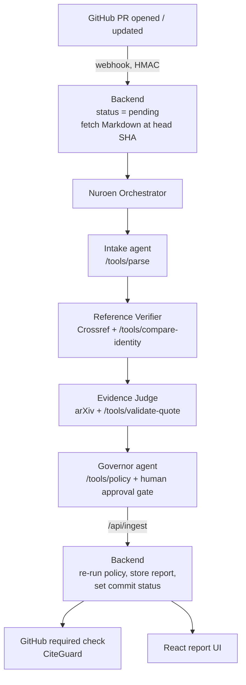

# 🛡️ CiteGuard

### Governed Citation Audit for AI-Written Reports: Evidence-Backed Findings, Human Approval, and a GitHub Merge Gate

[](https://cite-guard-beige.vercel.app/)
[](https://www.python.org/)
[](https://fastapi.tiangolo.com/)
[](https://react.dev/)
[](https://www.nuroen.com/)

[**Live Demo**](https://cite-guard-beige.vercel.app/)

> ⚠️ **Note:** The frontend runs on recorded mock reports (clearly badged "mock data") when no backend is connected. Any cached result shown in a demo is labeled **cached**, never presented as a fresh call.

---

## 📌 Overview

AI agents now write reports, briefs, and memos full of citations that nobody
checks. Reference checkers can tell you a citation *exists*; they do not tell
you whether the cited source actually **supports the claim**, and they do not
stop a bad report from being merged.

CiteGuard audits a Markdown report in a pull request and governs the result:

- **Four-to-five agents on Nuroen** (Intake, Reference Verifier, Evidence Judge,
  Governor, Orchestrator) extract claims, resolve each reference, retrieve
  open-access source text, and judge support, using connectors
  (GitHub, Crossref, arXiv, Slack, and our own tool service)
- A **deterministic policy engine** (plain code, no LLM) decides each
  finding's action and the final gate. Agents propose; code disposes
- A **GitHub required status check** (`CiteGuard`) blocks the merge while
  findings are blocked or awaiting review
- A **human approval gate** lets an allow-listed reviewer approve a finding
  with a recorded reason, bound to the exact commit that was audited
- A **React report page** shows, for every claim: identity status, evidence
  passage with locator, the judgment, the rule ID that fired, and the agent's
  action trace

**Why this matters:** an audit of published papers reported by STAT News found
fabricated references rising from 1 in 2,828 papers (2023) to 1 in 458 (2025)
and 1 in 277 in early 2026, and a public tracker of court decisions involving
AI-generated inaccurate content lists over a thousand cases. Any organization
shipping agent-written documents with sources faces the same question an
auditor asks: *what is the evidence chain?*

Built as a 3-person hackathon project for Nuroen AgentForge: platform agents,
backend gate and tools, and report UI integrated into one system.

---

## 🖥️ App Preview

*(screenshot placeholder: add `./assets/report-blocked.png` once captured)*

The app includes:

- **Report page** with a gate banner (Approved / Pending review / Blocked /
  Error), counts, and filterable findings
- **Finding cards** with three columns: Identity, Evidence, Judgment, plus
  rule-ID chips and the resulting action
- **Agent trace** showing each retrieval step with a short reason
- **Reviewer exception** notes that preserve the original policy result
- **Results page** for observed evaluation numbers and mandatory caveats
- **Mock mode** with four recorded reports: blocked, pending, passed, error

---

## ✨ Features

| Feature | Description |
| --- | --- |
| 🔎 **Claim-Level Audit** | Each claim–citation pair is checked for reference identity and for source support, not just existence |
| 🧱 **Deterministic Governance** | Actions and the gate come from `policy.py` rules (`CG-EXIST`, `CG-SUPPORT`, `CG-GATE`, `CG-HUMAN`, `CG-TRUST`), never from the model |
| 🚦 **GitHub Merge Gate** | Commit status `CiteGuard` maps to success / pending / failure / error |
| 🙋 **Commit-Bound Human Approval** | Exceptions need an allow-listed reviewer and a reason; an approval on a different commit clears nothing and marks the review stale |
| 🧪 **Untrusted-Source Handling** | Instruction-like text inside retrieved sources is treated as data, flagged (`CG-TRUST-01`), and can never auto-pass |
| ❓ **Honest Uncertainty** | An unresolved reference means "unresolved", never "fabricated"; "not supported" is limited to the evidence inspected |
| 📎 **Provenance Check** | Every quoted passage is validated as a verbatim substring of the retrieved text (provenance, not proof of meaning) |
| 🔒 **Signed + Idempotent Events** | GitHub webhooks verified by HMAC, duplicate deliveries ignored, one audit per commit |
| 🎬 **Mock Mode** | Four recorded reports generated from the real policy engine, so the UI works with no backend |

---

## 🏗️ Tech Stack

**Agents (external platform)**

- Nuroen: agents, orchestration, connectors, approval gate, audit trail

**Backend**

- Python · FastAPI · Pydantic
- Deterministic parser, policy engine, quote validation, identity comparison
- HMAC webhook verification, replay protection, host allow-listing
- GitHub REST API for commit status and PR file fetch
- No LLM calls and no LLM API key in the backend

**Frontend**

- React + Vite (plain `.jsx`)
- Live mode against the backend, or mock mode from `/public/mock`

---

## 📐 Architecture



**Gate states**

| State | Meaning |
| --- | --- |
| `success` | Every finding passes policy or has a valid exception |
| `pending` | Findings are awaiting human review |
| `failure` | A contradiction or confirmed identity mismatch is open |
| `error` | Extraction incomplete or a technical failure, which can never pass |

---

## 📊 Results

**Verified so far** (automated, reproducible):

| Check | Result |
| --- | --- |
| Backend tests (parser, policy, security, tools, ingest, webhook) | 30 passing |
| Frontend production build | Passing |
| Mock reports (blocked / pending / passed / error) | Generated by the real policy engine |
| Live GitHub PR flow and live Nuroen integration | **Not yet proven**: see limitations |

**Evaluation** (fill with observed values only; never estimate):

| Measure | Observed |
| --- | --- |
| Claim-support cases (labeled before running) | `[x]` cases (`[x]` dev / `[x]` held-out) |
| Semantic accuracy (abstentions count as not correct) | `[x]` / `[n]` |
| Unsafe automatic passes | `[x]` / `[n]` |
| Correct abstentions on simulated retrieval failures | `[x]` / `[n]` |
| Governance probes passed | `[x]` / 12 |
| Median latency · cost per audit | `[x]` s · `[x]` |

**Governance probes** (see `docs/PROBES.md`): injected instruction in a source,
malformed model output, reference-database failure, unauthorized approval,
replayed webhook, stale approval on a changed commit, blocked merge attempt,
partial extraction, empty extraction, exhausted tool budget, non-allow-listed
host, review timeout.

> **Honest framing:** judgments about whether a source supports a claim are LLM
> inferences over retrieved passages, not a replacement for human review.
> Identity checks, quote provenance, policy actions, and gate states are
> deterministic and independently checkable.

---

## 🚀 Getting Started

### Prerequisites

- Python 3.11+ and Node.js 18+
- A GitHub **fine-grained token** scoped to the **demo repo only**
  (Commit statuses: read/write, Contents: read, Pull requests: read)
- A Nuroen workspace with the agents published
- A tunnel for webhooks and tools (`cloudflared` or `ngrok`)

### 1. Clone and install

```bash
git clone https://github.com/<owner>/<repo>.git
cd <repo>
cd backend && python3 -m venv .venv && source .venv/bin/activate && pip install -r requirements.txt
cd ../frontend && npm install
```

### 2. Configure environment

```bash
cd backend && cp .env.example .env
```

Fill `GITHUB_TOKEN`, `GITHUB_WEBHOOK_SECRET`, `TOOLS_API_KEY`,
`REVIEWER_ALLOWLIST`, and (once known) `NUROEN_INVOKE_URL`. Generate secrets
with `python -c "import secrets; print(secrets.token_urlsafe(32))"`.
`.env` is gitignored; never commit it. No LLM key is needed here.

### 3. Run in mock mode (no external services)

```bash
cd backend && MOCK_MODE=true uvicorn app.main:app --reload --port 8000
cd frontend && npm run dev          # http://localhost:5173
```

### 4. Go live

```bash
cloudflared tunnel --url http://localhost:8000   # set PUBLIC_BASE_URL to the https URL
```

- GitHub (demo repo): webhook → `<tunnel>/webhooks/github`, content type
  JSON, event **Pull requests**; branch protection requiring status `CiteGuard`
- Nuroen: add a custom API connector at the tunnel URL with header `X-API-Key`
- Frontend: set `VITE_USE_MOCK=false` and `VITE_API_URL` in `frontend/.env`

### Checks

```bash
cd backend && python -m pytest -q
bash scripts/smoke.sh               # full integration check
bash scripts/sync-contract.sh       # after any change under contract/
```

---

## 📂 Project Structure

```text
CiteGuard/
├── backend/
│   ├── app/
│   │   ├── policy.py          # deterministic CG-* rules + gate decision
│   │   ├── parser.py          # frozen claim/citation syntax + extraction reconciliation
│   │   ├── security.py        # HMAC, replay protection, host allow-list, injection flag
│   │   ├── models.py          # Pydantic mirror of the contract
│   │   ├── store.py           # report store (seeded from mock data in mock mode)
│   │   ├── github_pr.py       # fetch PR Markdown at head SHA
│   │   ├── github_status.py   # commit status writer
│   │   ├── nuroen_client.py   # trigger the Nuroen orchestrator
│   │   ├── notify.py          # publish gate to GitHub
│   │   └── routes/
│   │       ├── api.py         # reports, audit, exceptions, GitHub webhook
│   │       └── tools.py       # /tools/* for Nuroen agents + /api/ingest
│   └── tests/
├── frontend/
│   └── src/
│       ├── api.jsx            # mock + live data access
│       ├── components/        # GateBanner, FindingCard, AgentTrace, SummaryBar, ...
│       └── pages/             # ReportPage, EvalPage
├── contract/                  # FROZEN: contract.js + mock/*.json
├── demo/                      # planted-error brief and variants
├── eval/                      # labeling template + evaluation rules
├── docs/                      # build plan, prompts, probes, backend change notes
└── scripts/                   # sync-contract.sh, gen_mocks.py, smoke.sh
```

---

## 🔬 Methodology Highlights

1. **The model proposes, code disposes**: Nuroen agents produce structured
   findings; `policy.py` alone decides actions and the gate, and `/api/ingest`
   re-runs it on whatever the agents send
2. **Identity before support**: a claim is never judged against a reference
   that failed identity checks
3. **Unresolved is not fabricated**: a failed search routes to review, and
   recent references that may not be indexed yet say so
4. **Sources are data, not instructions**: embedded instructions are flagged
   and cannot change status or policy
5. **Approvals are bound to a commit**: new commit, new audit, and old
   approvals clear nothing
6. **Bounded autonomy**: retries, tool calls, and runtime are capped; budget
   exhaustion stops and routes to a human instead of guessing

---

## 🎯 Key Design Decisions

- Keep policy deterministic so every verdict is explainable by a rule ID
- Report database agreement as provenance, not as votes or confidence
- Quote validation proves a passage exists in the source, not that it
  entails the claim, and the UI says so
- A fixture-based mock mode lets the UI and policy be tested without any
  external service

---

## 🔮 Known Limitations

- **Live GitHub PR fetch and live Nuroen invocation are not yet proven**:
  the invoke mechanism depends on what the platform exposes; manual trigger
  is the fallback
- **Support judgments are unverified LLM inferences** over retrieved
  passages; abstain and review rather than trust a single label
- **One open-access corpus** (arXiv-style full text): paywalled sources
  resolve to "evidence unavailable" and go to human review
- **Small curated evaluation**: results are not a general measure of
  fabricated-citation detection
- **Markdown only**, with a fixed citation syntax (`[@key]` plus a
  bibliography block)
- **Admin bypass** of branch protection depends on repository settings

---

## 👤 Team

**Nikhil**: Frontend lead (report UI, demo, evaluation page)
[GitHub](https://github.com/nikhil-0420)

**Sam**: Backend lead (policy engine, tool endpoints, GitHub gate)

**Nehaa**: Sub frontend (fixtures, evaluation labeling, presentation)

---

**⭐ If you found this project interesting, consider giving it a star.**
